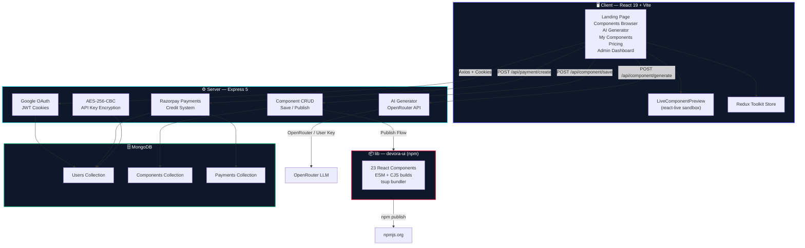
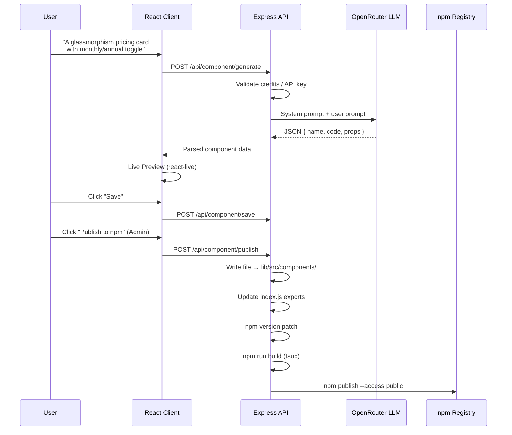

<div align="center">

# 🚀 DevoraUI

### The AI-Powered React UI Component Platform

[](https://devoraui-1.onrender.com)
[](https://www.npmjs.com/package/devora-ui)
[](https://react.dev)
[](https://nodejs.org)
[](https://www.mongodb.com)
[](LICENSE)

<br/>

**DevoraUI** is a full-stack platform that combines a hand-crafted React component library with an AI-powered component generator. Describe any UI in plain English — get production-ready React code in seconds. Preview it live, save it to your account, or publish it straight to npm — all from one place.

<br/>

[🌐 Live Demo](https://devoraui-1.onrender.com) · [📦 npm Package](https://www.npmjs.com/package/devora-ui) · [🤖 AI Generator](#-ai-component-generator) · [🧩 Components](#-component-library-23-components) · [📖 Architecture](#%EF%B8%8F-architecture)

<br/>

---

</div>

<br/>

## ✨ Why DevoraUI?

Most UI libraries stop at giving you pre-built components. **DevoraUI goes further** — it's a complete ecosystem where you can:

| Feature | Description |
|---|---|
| 🧩 **23+ Prebuilt Components** | Production-grade, dark-themed React components — install and use instantly |
| 🤖 **AI Component Generator** | Describe your UI in natural language → get fully working React JSX in seconds |
| 👁️ **Live Preview Sandbox** | Every generated component renders live in a `react-live` sandbox before you commit |
| 💾 **Cloud Save** | Authenticated users can save generated components to their personal library |
| 📦 **One-Click npm Publish** | Admin-generated components are published to the `devora-ui` npm package automatically |
| 🔐 **Google OAuth** | Seamless one-click authentication via Firebase |
| 💳 **Razorpay Payments** | Credit-based monetization — users purchase AI credits to generate components |
| 🔑 **Bring Your Own API Key** | Users can plug in their own OpenRouter API key (AES-256-CBC encrypted at rest) |
| 📊 **Admin Dashboard** | Full analytics dashboard with charts, user management, and component publishing |

<br/>

## 🏗️ Architecture

DevoraUI is a **monorepo** with three independent packages working in concert:

```
DevoraUI/
├── 📁 client/          → React 19 + Vite 8 frontend (SPA)
├── 📁 server/          → Express 5 REST API backend
└── 📁 lib/             → The npm package (devora-ui) — publishable component library
```



<br/>

## 📦 Quick Install

Install the component library in any React project:

```bash
npm install devora-ui
```

Import and use components with zero configuration:

```jsx
import { Button, Card, Modal, DataTable } from "devora-ui";

export default function App() {
  return (
    <Card title="Dashboard">
      <Button text="Get Started" variant="primary" size="md" />
    </Card>
  );
}
```

> **Note:** All components use inline styles — no CSS imports, no Tailwind, no build-time configuration needed. They're designed with a premium dark theme out of the box.

<br/>

## 🧩 Component Library (23 Components)

Every component ships with sensible defaults, dark-themed styling, and customizable props:

| Category | Components |
|---|---|
| **🎯 Actions** | `Button` · `GlowButton` |
| **📝 Form Inputs** | `Input` · `Textarea` · `Select` · `Checkbox` · `RadioGroup` · `Switch` · `FileUploader` |
| **📐 Layout** | `Card` · `Navbar` · `Sidebar` · `Tabs` · `Accordion` · `Pagination` |
| **💬 Feedback** | `Alert` · `Badge` · `Toast` · `Tooltip` · `LoadingCard` |
| **🪟 Overlays** | `Modal` · `Drawer` |
| **📊 Data** | `DataTable` |

### Component Design Philosophy

- 🎨 **Dark-first design** — backgrounds like `#0f172a`, `#020617` with rich accent colors
- 📐 **Inline styles only** — zero CSS dependencies, works everywhere
- ⚡ **Prop-driven** — every visual aspect is customizable via props with sensible defaults
- 🧱 **Self-contained** — each component is a single file, no cross-dependencies
- 🔤 **System fonts** — uses `system-ui, -apple-system, sans-serif` for instant loading

### Example: Button Variants

```jsx
import { Button } from "devora-ui";

// Primary (default)
<Button text="Get Started" />

// Secondary
<Button text="Learn More" variant="secondary" />

// Ghost
<Button text="Cancel" variant="ghost" />

// Danger
<Button text="Delete" variant="danger" />

// Sizes
<Button text="Small" size="sm" />
<Button text="Medium" size="md" />
<Button text="Large" size="lg" />

// States
<Button text="Loading..." loading={true} />
<Button text="Disabled" disabled={true} />
```

<br/>

## 🤖 AI Component Generator

The crown jewel of DevoraUI — describe any React component in plain English, and the AI builds it for you.

### How It Works



### What the AI Generates

The AI is prompted with strict engineering constraints to produce components that:

- ✅ Use **named exports** (`export const ComponentName = ...`)
- ✅ Use **inline styles only** — no CSS, no Tailwind, no styled-components
- ✅ Have **all props with default values** — look great with zero props passed
- ✅ Use **no external dependencies** — only React hooks
- ✅ Follow a **premium dark UI aesthetic** with rich gradients and subtle animations
- ✅ Are **sandbox-safe** — no `position: fixed`, no template literals in styles
- ✅ Include a built-in **hex-to-rgba helper** for dynamic opacity

### AI Credit System

| Plan | Credits | Price |
|---|---|---|
| **Starter** | 150 credits | Free (on signup) |
| **Pro** | +200 credits | ₹99 |

Each component generation costs **50 credits**. Users can also bring their own OpenRouter API key to bypass the credit system entirely.

<br/>

## 🔒 Security

DevoraUI takes security seriously:

| Layer | Implementation |
|---|---|
| **Authentication** | Google OAuth via Firebase → JWT cookie (7-day expiry, `secure`, `sameSite: none`) |
| **API Key Storage** | AES-256-CBC encryption with random IV per key — keys are never stored in plaintext |
| **API Key Decryption** | Server-side only; encrypted keys are decrypted at generation time, never sent to client |
| **Payment Verification** | Razorpay HMAC-SHA256 signature verification on every payment |
| **Authorization** | JWT middleware on all protected routes; role-based access (`admin` / `user`) |
| **CORS** | Strict origin whitelist — only production domain and localhost allowed |

<br/>

## 🛠️ Tech Stack

### Frontend (`client/`)

| Technology | Purpose |
|---|---|
| **React 19** | UI framework |
| **Vite 8** | Build tool & dev server |
| **Tailwind CSS 4** | Utility-first styling |
| **Redux Toolkit** | Global state management |
| **React Router 7** | Client-side routing |
| **Motion (Framer Motion)** | Animations & transitions |
| **react-live** | Live component preview sandbox |
| **Recharts** | Analytics charts (Admin Dashboard) |
| **Firebase** | Google OAuth authentication |
| **Axios** | HTTP client |
| **react-hot-toast** | Toast notifications |
| **react-icons** | Icon library |

### Backend (`server/`)

| Technology | Purpose |
|---|---|
| **Express 5** | Web framework |
| **Mongoose 9** | MongoDB ODM |
| **JSON Web Tokens** | Session authentication |
| **Razorpay SDK** | Payment processing |
| **crypto (AES-256-CBC)** | API key encryption |
| **OpenRouter API** | LLM access for AI generation |
| **cookie-parser** | Cookie handling |
| **CORS** | Cross-origin resource sharing |

### Library (`lib/`)

| Technology | Purpose |
|---|---|
| **tsup** | Bundle components into ESM + CJS |
| **TypeScript** | Build tooling (no TS in components) |
| **React 19** | Peer dependency |

<br/>

## 📂 Project Structure

```
DevoraUI/
│
├── client/                          # React frontend (Vite SPA)
│   ├── src/
│   │   ├── pages/
│   │   │   ├── Home.jsx             # Landing page with features, steps, CTA
│   │   │   ├── Generate.jsx         # AI component generator studio
│   │   │   ├── AllComponents.jsx    # Public component browser
│   │   │   ├── MyComponents.jsx     # User's saved components
│   │   │   ├── Pricing.jsx          # Credit purchase plans (Razorpay)
│   │   │   └── AdminDashboard.jsx   # Admin panel (stats, charts, publish)
│   │   ├── components/
│   │   │   ├── Auth.jsx             # Google OAuth modal
│   │   │   └── LiveComponentPreview.jsx  # react-live sandbox wrapper
│   │   ├── redux/
│   │   │   └── userSlice.js         # Global state (user, components, users)
│   │   └── utils/
│   ├── public/
│   └── package.json
│
├── server/                          # Express REST API
│   ├── controllers/
│   │   ├── aiComponent.controller.js  # AI generation (OpenRouter + prompt engineering)
│   │   ├── auth.controller.js         # Google OAuth login/logout
│   │   ├── component.controller.js    # Save, publish, list components
│   │   ├── payment.controller.js      # Razorpay order creation & verification
│   │   └── user.controller.js         # User profile, API key management
│   ├── models/
│   │   ├── user.model.js              # User schema (credits, role, encrypted key)
│   │   ├── component.model.js         # Component schema (code, props, visibility)
│   │   └── payment.model.js           # Payment schema (Razorpay order tracking)
│   ├── middlewares/
│   │   └── auth.middleware.js         # JWT verification middleware
│   ├── routes/
│   │   ├── auth.route.js
│   │   ├── component.route.js
│   │   ├── payment.route.js
│   │   └── user.route.js
│   ├── config/
│   │   ├── connectDB.js               # MongoDB connection
│   │   └── token.js                   # JWT token generation
│   ├── utils/
│   │   ├── openRouter.js              # OpenRouter API wrapper
│   │   └── razorPay.js                # Razorpay instance
│   └── index.js                       # Express server entry point
│
└── lib/                             # npm package (devora-ui)
    ├── src/
    │   ├── components/
    │   │   ├── Accordion/
    │   │   ├── Alert/
    │   │   ├── Badge/
    │   │   ├── Button/
    │   │   ├── Card/
    │   │   ├── Checkbox/
    │   │   ├── DataTable/
    │   │   ├── Drawer/
    │   │   ├── FileUploader/
    │   │   ├── GlowButton/
    │   │   ├── Input/
    │   │   ├── LoadingCard/
    │   │   ├── Modal/
    │   │   ├── Navbar/
    │   │   ├── Pagination/
    │   │   ├── RadioGroup/
    │   │   ├── Select/
    │   │   ├── Sidebar/
    │   │   ├── Switch/
    │   │   ├── Tabs/
    │   │   ├── Textarea/
    │   │   ├── Toast/
    │   │   └── Tooltip/
    │   └── index.js                   # Barrel exports for all components
    ├── tsup.config.js                 # Build config (ESM + CJS)
    └── package.json
```

<br/>

## 🚀 Getting Started (Development)

### Prerequisites

- **Node.js** ≥ 18
- **MongoDB** instance (local or Atlas)
- **Firebase** project (for Google OAuth)
- **Razorpay** account (for payments)
- **OpenRouter** API key (for AI generation)

### 1. Clone the Repository

```bash
git clone https://github.com/prit-zalavadiya-78/DevoraUI.git
cd DevoraUI
```

### 2. Setup the Server

```bash
cd server
npm install
```

Create a `.env` file in `server/`:

```env
PORT=5000
MONGO_URI=mongodb+srv://your-connection-string
JWT_SECRET=your-jwt-secret
OPENROUTER_API_KEY=sk-or-xxxxxxxxxxxx
RAZORPAY_KEY_ID=rzp_xxxxxxxxxxxxx
RAZORPAY_KEY_SECRET=xxxxxxxxxxxxxxxx
ENCRYPTION_KEY=your-64-char-hex-string
```

Start the server:

```bash
npm run dev
```

### 3. Setup the Client

```bash
cd client
npm install
```

Create a `.env` file in `client/`:

```env
VITE_API_URL=http://localhost:5000
VITE_RAZORPAY_KEY_ID=rzp_xxxxxxxxxxxxx
VITE_FIREBASE_API_KEY=your-firebase-api-key
VITE_FIREBASE_AUTH_DOMAIN=your-project.firebaseapp.com
VITE_FIREBASE_PROJECT_ID=your-project-id
```

Start the development server:

```bash
npm run dev
```

### 4. Setup the Library (optional)

```bash
cd lib
npm install
npm run build
```

<br/>

## 🌐 API Reference

### Authentication

| Method | Endpoint | Description | Auth |
|---|---|---|---|
| `POST` | `/api/auth/google` | Google OAuth login | ❌ |
| `POST` | `/api/auth/logout` | Clear auth cookie | ❌ |

### Users

| Method | Endpoint | Description | Auth |
|---|---|---|---|
| `GET` | `/api/user/current-user` | Get authenticated user | ✅ |
| `GET` | `/api/user/all-users` | List all users (admin) | ✅ |
| `POST` | `/api/user/set-api-key` | Save encrypted OpenRouter key | ✅ |
| `POST` | `/api/user/remove-api-key` | Remove stored API key | ✅ |

### Components

| Method | Endpoint | Description | Auth |
|---|---|---|---|
| `POST` | `/api/component/generate` | AI-generate a component | ✅ |
| `POST` | `/api/component/save` | Save component to DB | ✅ |
| `POST` | `/api/component/publish` | Publish to npm (admin) | ✅ |
| `GET` | `/api/component/all-components` | List all components | ✅ |

### Payments

| Method | Endpoint | Description | Auth |
|---|---|---|---|
| `POST` | `/api/payment/create` | Create Razorpay order | ✅ |
| `POST` | `/api/payment/verify` | Verify payment signature | ✅ |

<br/>

## 📸 Pages Overview

| Page | Route | Description |
|---|---|---|
| **Home** | `/` | Hero section, feature grid, how-it-works steps, CTA, footer |
| **AI Generator** | `/generate` | Prompt input, credit display, live preview, code view, save/publish |
| **Components** | `/components` | Browse all public components with live preview |
| **My Components** | `/my-components` | User's personally saved components |
| **Pricing** | `/pricing` | Starter (free) and Pro (₹99) plans with Razorpay checkout |
| **Admin Dashboard** | `/admin` | Stats cards, area chart, component list, add/publish components |

<br/>

## 🔄 The Publish Pipeline

When an admin publishes a component, the server orchestrates a **fully automated npm release**:

```
1. Write component file → lib/src/components/{Name}/{Name}.jsx
2. Append export to   → lib/src/index.js
3. Delete old dist/   → rm -rf lib/dist
4. Bump version       → npm version patch --no-git-tag-version
5. Build bundle       → npm run build (tsup → ESM + CJS)
6. Publish            → npm publish --access public
7. Update DB          → visibility: "public", npmPackageName: "devora-ui"
```

The result? Users around the world can immediately `npm install devora-ui@latest` and import the new component.

<br/>

## 🧠 AI Prompt Engineering

The AI system prompt is carefully engineered with:

- **Strict JSON output format** — name, code, and props array
- **Code rules** — named exports, inline styles, no external deps, no TypeScript
- **Design rules** — dark backgrounds, rich accents, premium gradients, system fonts
- **Sandbox rules** — compatible with react-live (no `position: fixed`, no imports)
- **Anti-patterns** — no template literals in JSX styles (use string concatenation)
- **Built-in examples** — Button, ImageCard, and Navbar as few-shot references

<br/>

## 🤝 Contributing

Contributions are welcome! Here's how to get started:

1. **Fork** the repository
2. **Create** a feature branch (`git checkout -b feature/amazing-component`)
3. **Commit** your changes (`git commit -m 'Add amazing component'`)
4. **Push** to the branch (`git push origin feature/amazing-component`)
5. **Open** a Pull Request

<br/>

## 📄 License

This project is licensed under the **ISC License** — see the [LICENSE](LICENSE) file for details.

<br/>

---

<div align="center">

**Built with 🔥 by [Prit Zalavadiya](https://github.com/prit-zalavadiya-78)**

<br/>

<sub>If DevoraUI helps you build something amazing, consider giving it a ⭐</sub>

</div>
